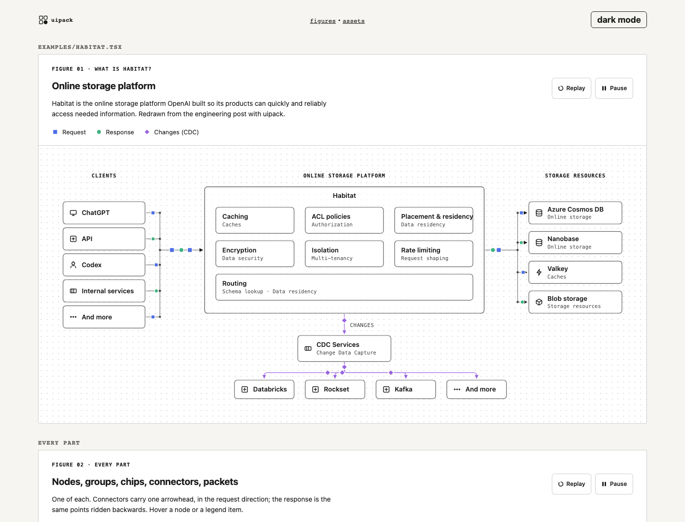

# uipack

React and SVG figure components for engineering write-ups. Framed figures, lanes, nodes, connectors, and packets that move along them. These are the diagrams behind [junxiong.dev](https://junxiong.dev).

I wanted the figures from OpenAI's [Habitat post](https://openai.com/index/scaling-storage-one-billion-users-part-one/): a mono eyebrow, one title, one caption, a shape-coded legend, Pause and Replay, a dotted grid, and small tokens riding the arrows. My site already had hand-laid SVG primitives on an 8px grid. This package is those primitives, extended until they can draw that figure, with the frame and the motion added.



## Install

Not on npm yet (the name belongs to someone else's placeholder). Install from GitHub; `dist/` is committed so there is no build step on the consumer side.

```sh
npm install github:ong6/uipack
```

```tsx
import "uipack/theme.css";
import { Figure, Defs, Node, Connector, Packet, route } from "uipack";

const path = route([216, 60], [400, 140], "h"); // orthogonal, elbow at the midpoint

export function RequestFlow() {
  return (
    <Figure
      number="Figure 01"
      eyebrow="Request flow"
      title="One client, one service"
      caption="The client calls the service; the response rides the same path back."
      legend={[{ label: "Request", kind: "request" }, { label: "Response", kind: "response" }]}
      viewBox="0 0 640 200"
      alt="A client node on the left connected to a service node on the right.">
      <Defs id="rf" />
      <Node x={16} y={40} w={200} h={40} label="Client" icon="client" />
      <Node x={400} y={120} w={200} h={40} label="Service" icon="service" />
      <Connector points={path} defs="rf" kind="request" />
      <Packet points={path} kind="request" dur={2} />
      <Packet points={path} kind="response" dur={2} delay={-1} reverse />
    </Figure>
  );
}
```

`examples/Habitat.tsx` is the full Habitat overview, wide and narrow, built from nothing but these parts. `npm run dev` opens a playground that renders every component in both themes.

## Components

| Component | Props | Does |
|---|---|---|
| `Figure` | `number`, `eyebrow`, `title`, `caption`, `legend`, `headingLevel`, `controls`, `viewBox`, `narrow`, `narrowViewBox`, `alt`, `theme` | The frame: header, legend, Pause and Replay, dotted canvas, wide and narrow drawings swapped at 720px. Owns the SVG timeline. |
| `Legend` | `items: {label, kind, shape}[]` | Shape-coded key. Rendered by `Figure`; exported for use elsewhere. |
| `Lane` | `x`, `w`, `y`, `title`, `h` | Mono uppercase column header, optional faint rule. |
| `Group` | `x`, `y`, `w`, `h`, `title`, `variant: solid \| dashed`, `accent` | A boxed service (solid, centred title) or an environment boundary (dashed, mono title). |
| `Node` | `x`, `y`, `w`, `h`, `label`, `sub`, `icon`, `align`, `accent`, `dashed` | A box with a label, a mono second line, and an icon slot. |
| `Chip` | `x`, `y`, `w`, `h`, `label`, `dashed`, `kind` | A pill: a connection slot, a queued request, a status flag. |
| `Connector` | `points`, `defs`, `arrow: boolean \| both`, `dashed`, `kind`, `radius`, `id` | A rounded polyline with arrowheads coloured by token kind. |
| `Packet` | `points`, `kind`, `shape`, `dur`, `delay`, `reverse`, `at`, `r` | A token that rides the same points, looping. |
| `Badge` | `cx`, `cy`, `text`, `accent` | A circled step number. |
| `Label` | `x`, `y`, `text`, `anchor`, `font`, `accent` | Text with a page-coloured underlay so it can sit on a line. |
| `Defs` | `id` | Arrowhead markers, one per token kind. Put one in every SVG. |
| `Token` | `kind`, `shape`, `r`, `cx`, `cy` | The shape itself: square for request, circle for response, diamond for change. |

Helpers: `anchor(box, side, t)` gives a point on a box edge, `route(from, to, via)` builds an orthogonal polyline, `pathFromPoints(points, radius)` turns it into path data, `pointAlong(points, t)` walks it. `icons` holds nine 16px line glyphs: db, cache, queue, service, client, blob, agent, doc, more.

## Theming

Every colour is a CSS custom property on `.uipack`, so a host restyles by setting variables on any ancestor. Dark mode follows `prefers-color-scheme` and can be forced with `data-theme="dark"` on `<html>` or on the figure.

```css
.uipack {
  --uipack-fg: #1a1c1a;
  --uipack-bg: #ffffff;
  --uipack-surface: #ffffff;
  --uipack-accent: #205f49;
  --uipack-token-request: #4f6fe6;
  --uipack-token-response: #3fb27f;
  --uipack-token-change: #9a63e0;
  --uipack-mono: ui-monospace, Menlo, monospace;
  --uipack-sans: system-ui, sans-serif;
}
```

Strokes are `currentColor`, so a figure inherits the page's text colour and one accent per figure does the highlighting.

## Motion

Packets animate with SMIL `animateMotion`. I picked SMIL over CSS `offset-path` because `Figure` can then drive the whole SVG timeline with `pauseAnimations()` and `setCurrentTime(0)`, which is what Pause and Replay do; every packet keeps its offset after a replay and nothing needs JavaScript per frame. Chromium and WebKit both pass the browser suite on it.

Under `prefers-reduced-motion: reduce` a packet renders once at `at` (default the path midpoint) and never moves, and the controls disappear. Server rendering also produces the static token; motion starts after mount.

## Testing

`npm test` runs 20 vitest cases in jsdom: geometry, props, the header, Pause state, reduced motion, the narrow swap. `npm run test:e2e` runs 6 Playwright cases in Chromium and WebKit, 12 in total: a packet moves between two samples, holds still after Pause, resumes on Play, returns to the path start on Replay, sits at the midpoint under reduced motion, and both themes render three figures with no console errors. The CI workflow runs both with job timeouts.

Playwright is pinned at 1.61.1 because the 1.63 browser build would not download on my network. Bump it when that clears.

## Roadmap

- v2: stepped stories, the 01 / 02 / 03 tabs that change the scene.
- Counters and stat tiles on nodes (the "3 concurrent requests" pattern).
- Export to PNG and video for slides.
- 3D and motion beyond the page, once the site needs them.

## Credit

The look is OpenAI's, from the Habitat post linked above. The idea of typed, validated figures comes from [archify](https://github.com/tt-a1i/archify). The primitives grew out of the diagrams on junxiong.dev.

MIT.

## More from ong6

Forges make things, packs bundle them.

- [groundplane](https://github.com/ong6/groundplane) — fails the build when an agent asserts a fact its tools never produced
- [jobforge](https://github.com/ong6/jobforge) — grades the interview plan you say out loud, not the code you submit
- [skillforge](https://github.com/ong6/skillforge) — skill discovery, versioning and baseline-aware evaluation
- [deckforge](https://github.com/ong6/deckforge) — agent-first presentation studio with a measured preflight
- [proofpack](https://github.com/ong6/proofpack) — pilot evidence, review proposals and customer-safe handovers
- [fieldpack](https://github.com/ong6/fieldpack) — deckforge, skillforge and proofpack as one local-first suite
- [skillpack](https://github.com/ong6/skillpack) — the Claude Code and Codex skills used across all of these
