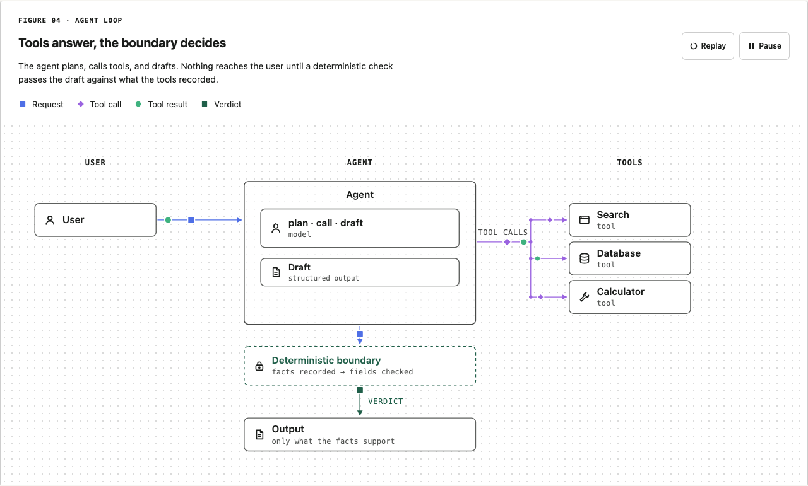
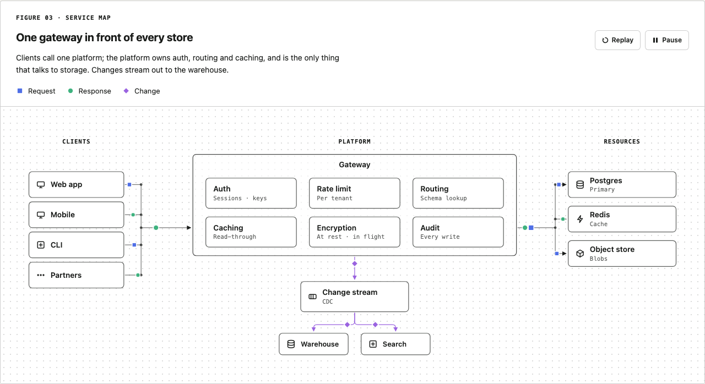
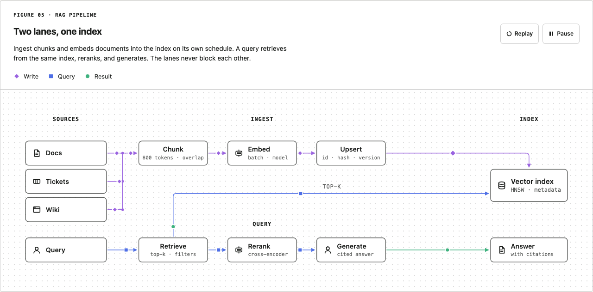
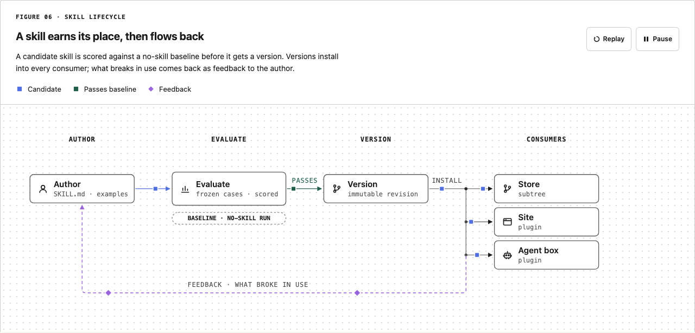
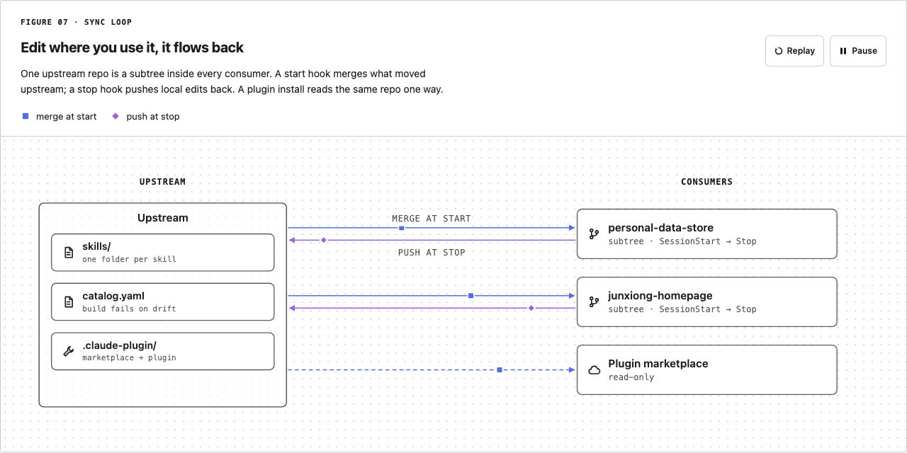
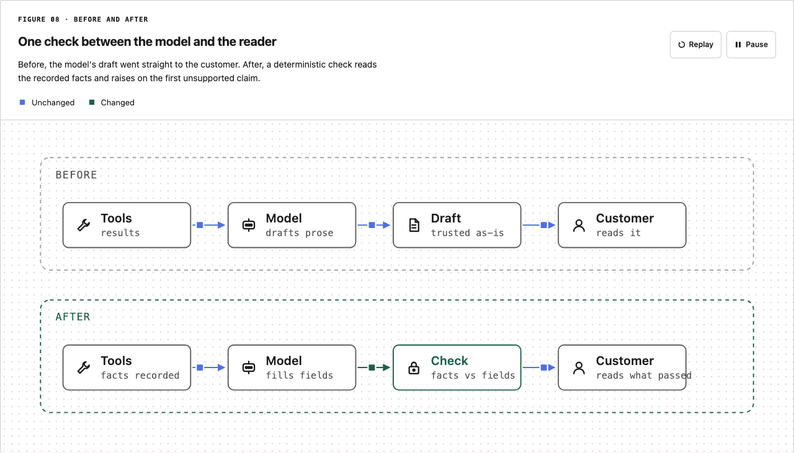
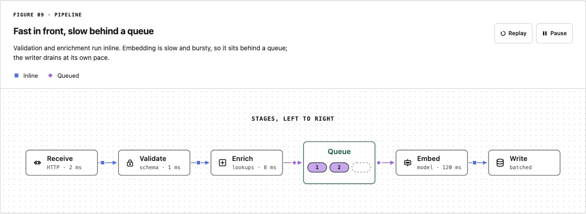
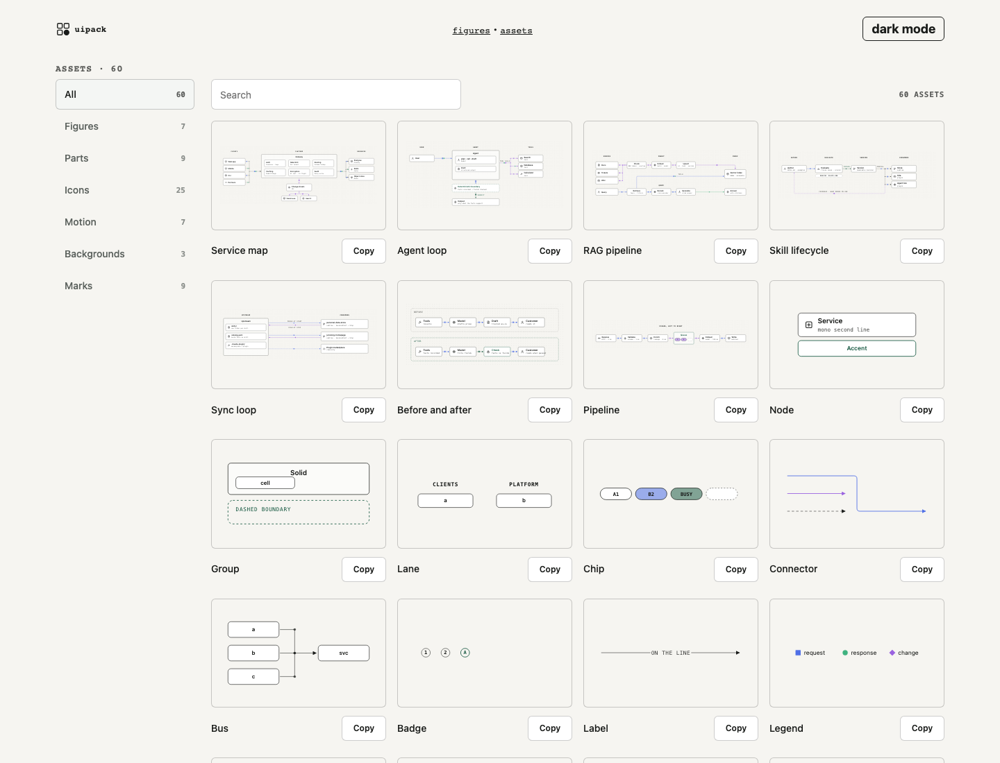

# uipack

React and SVG figure components for engineering write-ups: framed figures, lanes, nodes, connectors, packets that move along them, seven ready figure presets, and an asset browser. These are the diagrams behind [junxiong.dev](https://junxiong.dev).

I wanted the figures from OpenAI's [Habitat post](https://openai.com/index/scaling-storage-one-billion-users-part-one/): a mono eyebrow, one title, one caption, a shape-coded legend, Pause and Replay, a dotted grid, and small tokens riding the arrows. My site already had hand-laid SVG primitives on an 8px grid. This package is those primitives, extended until they draw that figure, with the frame, the motion and the hover added.



## Install

Not on npm yet (the bare name belongs to someone else's placeholder). Install from GitHub; `dist/` is committed so there is no build step on the consumer side.

```sh
npm install github:ong6/uipack
```

```tsx
import "uipack/theme.css";
import { Figure, Defs, Node, Connector, Packet, route } from "uipack";

const path = route([216, 60], [400, 140], "h"); // orthogonal, elbow at the midpoint

export function RequestFlow() {
  return (
    <Figure
      number="Figure 01"
      eyebrow="Request flow"
      title="One client, one service"
      caption="The client calls the service; the response rides the same path back."
      legend={[{ label: "Request", kind: "request" }, { label: "Response", kind: "response" }]}
      viewBox="0 0 640 200"
      alt="A client node on the left connected to a service node on the right.">
      <Defs id="rf" />
      <Node x={16} y={40} w={200} h={40} label="Client" icon="client" flow="call" />
      <Node x={400} y={120} w={200} h={40} label="Service" icon="service" flow="call" />
      <Connector points={path} defs="rf" kind="request" flow="call" />
      <Packet points={path} kind="request" dur={2} flow="call" />
      <Packet points={path} kind="response" dur={2} delay={-1} reverse flow="call" />
    </Figure>
  );
}
```

Separate entries, so a page loads only what it draws: `uipack` for parts, `uipack/presets` for ready figures, `uipack/presentations` for slide starters and speaker guides, and `uipack/browser` with `uipack/browser.css` for the asset browser.

`npm run dev` opens a playground: `/` renders the Habitat example, every part, and every preset; `/assets` renders the asset browser; `/animations` renders the 3D animation collection (`/slides` remains an alias), `/presentations` shows a complete narrative example, and `/styles` indexes visual styles.

## 3D animations

An optional `uipack/slides` entry adds authored camera transitions, editable scene data, projected HTML labels, keyboard presentation controls, and a diagram fallback. It ships six examples: **Harness dive**, **Retrieval layers**, **Parallel agents**, **Quarter turn**, **Staged assembly**, and **Before / after**, with 23 directly addressable stops in total. Camera arcs, dolly moves, and staggered arrivals are configurable per stop.

```sh
npm install three@^0.186.0 gsap@^3.15.0
```

```tsx
import { SlidePlayer, harnessDive } from "uipack/slides";
import "uipack/slides.css";

<SlidePlayer story={harnessDive} theme="dark" />;
```

Use `SlideScene` with a controlled `stopId` to connect the persistent scene to another deck. Three.js and GSAP are optional peers and are not imported by the SVG figure entries. These are live browser presentations; native slide-file and video export are separate work.

[Slide API, story format, accessibility, and integration guide](docs/slides.md).

## Presentation starters

`uipack/presentations` exports typed Opening, Explanation, and System layouts. Each slide carries its visible content and a separate speaker guide with the words to say, a delivery cue, and an optional bridge. `SlideStarter` renders both; `renderSlideSvg` creates a self-contained editable 16:9 SVG without speaker notes.

[Presentation starter API and example](docs/presentations.md).

## Parts

- `Figure`: the frame. Eyebrow, title (`headingLevel` picks the element), caption, legend, Pause and Replay, a canvas with a `background` of `dots`, `plain` or `ruled`, and a `narrow` drawing swapped in below 720px. Owns the SVG timeline, hover and selection state, and optional expanded canvas.
- `Lane`: mono uppercase column header, centred over `x..x+w`.
- `Group`: a boxed service (solid, centred title) or a dashed boundary (mono title).
- `Node`: a box with a label, a mono `sub`, an `icon`, an optional `hint` (native tooltip) and `href` (renders as a link with a focus ring).
- `Chip`: a pill for a connection slot, a queued item, a status flag.
- `Connector`: a rounded orthogonal path with one arrowhead.
- `Bus`: a trunk with stubs and a junction dot at each join. `busStub` and `busStubs` give the same points to packets.
- `Packet`: a token that rides a connector's points, looping.
- `Badge`, `Label`, `Legend`, `Token`, `Defs`: step numbers, text with an underlay, the key, the shape itself, the arrowhead markers.
- `icons`: 25 line glyphs in a 16px box (db, cache, queue, service, client, blob, agent, doc, model, tool, gateway, lock, key, clock, cron, browser, terminal, git, cloud, region, user, robot, chart, warning, more). `marks`: my own marks for the tool family, plus `Wordmark`.
- Geometry: `anchor`, `route`, `pathFromPoints`, `pointAlong`, `trim`, `polylineLength`, `grid`.

### The connector rule

One connector, one arrowhead, at the end, in the request direction. The response is the same points ridden backwards by a `Packet` with `reverse`. Two different relations between the same boxes (pull and push, say) are two connectors 16 units apart. A stub that joins a bus carries no arrowhead; the junction dot marks the join, and only a stub that enters a node gets a head.

Connectors stop 2 units short of their first and last point, and 4 short at the arrow end, so a head never touches a border. Packets start `r + 2` units after the source end and stop 12 before the arrowhead end, measured in the connector's own direction whichever way the packet rides, so a token never overlaps a border or a head. The browser suite checks both on every drawing in the playground.

## Interaction

Hover is opt-in and CSS-driven. Give parts a `flow` name (a string or a list): hovering a `Node` with a flow sets `data-hover-flow` on the figure, every element sharing that flow gets `data-state="hit"` (accent stroke, full opacity) and everything else `data-state="dim"` (opacity 0.35), with a 160ms transition. Hovering a legend item does the same by `kind`, so "Response" lights every response line and packet. A node on its own lifts its surface and turns its border accent on hover. Touch devices get none of it (`@media (hover: hover)`), and reduced motion drops the transition.

## Presets

Seven figures from a small typed spec, each with wide and narrow drawings, packets on the flows that matter, and hover flows wired. Import from `uipack/presets`; every preset ships a `default…` spec and a `…Parts()` function if you want the drawing without the frame.

| Preset | Spec | Shape |
|---|---|---|
| `serviceMap` | `clients`, `platform { title, cells, footer? }`, `resources`, `sinks?` | Three lanes, a bus each side, a change stream below. The Habitat shape. |
| `agentLoop` | `user`, `agent`, `tools`, `boundary`, `output` | Request in, tool calls out and results back, a deterministic check before the output. |
| `ragPipeline` | `sources`, `ingest`, `index`, `query`, `stages`, `answer` | Ingest lane on top writing to an index, query lane below reading from it. |
| `skillLifecycle` | `author`, `evaluate { baseline }`, `version`, `consumers`, `feedback` | Author, evaluate against a baseline, version, install everywhere, feedback back. |
| `syncLoop` | `upstream { items }`, `consumers [{ hooks?, plugin? }]` | One upstream, pull and push per consumer, a one-way plugin read. |
| `beforeAfter` | `before { stages }`, `after { stages, changed }` | Two stacked panels; the changed stage and its inbound edge in accent. |
| `pipeline` | `stages`, `queue? { after, depth }` | A line of stages with a queue between two of them. |








`examples/Habitat.tsx` stays as the reference drawing, built from the parts by hand.

## Assets

`assets/manifest.json` lists every asset with a rendered preview under `docs/assets/`, and `AssetBrowser` (from `uipack/browser`) shows it: categories with counts down the left, a search box, a grid of cards with the preview on a light tile even in dark mode, and one action, which copies the import line or the SVG.



```json
{
  "version": 1,
  "generated": "2026-09-16",
  "assets": [
    {
      "id": "icon-lock",
      "name": "lock",
      "category": "Icons",
      "kind": "icon",
      "preview": "docs/assets/icon-lock.svg",
      "source": "<Node … icon=\"lock\" />  // or: icons.lock",
      "tags": ["icon", "lock"]
    }
  ]
}
```

`kind` is one of `figure`, `part`, `icon`, `motion`, `background`, `mark`. Today: 7 figures, 9 parts, 25 icons, 7 motion, 3 backgrounds, 9 marks. Marks are my own only; no third-party logos. `npm run manifest` re-renders the previews and rewrites the file.

```tsx
import "uipack/browser.css";
import { AssetBrowser } from "uipack/browser";
import manifest from "uipack/assets/manifest.json";

<AssetBrowser manifest={manifest} initialCategory="Figures" base="/uipack/" />
```

`onAction` replaces the copy, `actionLabel` renames the button. The sidebar collapses to a row of chips below 720px; every target is 44px.

## Static export

`uipack/static` turns a figure into one SVG file with no dependency on the page: every CSS variable
becomes a literal, fonts are declared inline, and the SMIL packets stay in when you want them. Made
for a README, a Markdown site or a slide, where the file goes through `` and `currentColor`
never reaches the drawing.

```ts
import { writeFileSync } from "node:fs";
import { agentLoop } from "uipack/presets";
import { renderStatic } from "uipack/static";

writeFileSync("figure.svg", renderStatic(agentLoop(spec), { theme: "dark", motion: true }));
```

| Option | Default | Does |
|---|---|---|
| `theme` | `"light"` | `"light"`, `"dark"`, or `{ base, ...overrides }` with any `--uipack-*` key as a literal |
| `motion` | `true` | keep `animateMotion` (it runs inside `` in every current browser) or render each packet once at its `at` |
| `frame` | `true` | draw eyebrow, title, caption, legend and the border in SVG; `false` gives the bare drawing |
| `background` | `true` | paint the canvas and dotted grid; `false` lets the page surface show through |
| `width` | viewBox width | the file's `width` attribute; height follows |
| `minFont` | `11` | text floor in CSS px at the width the file is shown at (1088 when `width` is not given) |

The input is what a preset returns, a `<Figure>` element, or a bare `{ children, viewBox }`. The
asset previews under `docs/assets/` come from the same call, so a preview in the browser and a file
in a README are the same pixels. Tested through `` in Chromium and WebKit: the packets move
when `motion` is on and hold still when it is off.

## Theming

Every colour is a CSS custom property on `.uipack`, so a host restyles by setting variables on any ancestor. Dark mode follows `prefers-color-scheme` and can be forced with `data-theme="dark"` on `<html>` or on the figure.

```css
.uipack {
  --uipack-fg: #1a1c1a;
  --uipack-bg: #ffffff;
  --uipack-surface: #ffffff;
  --uipack-surface-raised: #f4f6f4;
  --uipack-accent: #205f49;
  --uipack-token-request: #4f6fe6;
  --uipack-token-response: #3fb27f;
  --uipack-token-change: #9a63e0;
  --uipack-mono: ui-monospace, Menlo, monospace;
  --uipack-sans: system-ui, sans-serif;
}
```

Strokes are `currentColor`, so a figure inherits the page's text colour and one accent per figure does the highlighting.

## Motion

Packets animate with SMIL `animateMotion`. I picked SMIL over CSS `offset-path` because `Figure` can then drive the whole SVG timeline with `pauseAnimations()` and `setCurrentTime(0)`, which is what Pause and Replay do; every packet keeps its offset after a replay and nothing needs JavaScript per frame. Chromium and WebKit both pass the browser suite on it.

Under `prefers-reduced-motion: reduce` a packet renders once at `at` and never moves, and the controls disappear. `at` defaults to `(0.5 + delay / dur) mod 1`, so packets that share a path spread out instead of stacking on the midpoint. Server rendering also produces the static token; motion starts after mount.

### Text floor

`Figure` takes `minFont` (default 11 CSS px). It measures the width each drawing renders at with a ResizeObserver (1088 assumed before that, and on the server) and turns the floor into user units from the viewBox width, so Node, Lane, Label, Chip, Badge and Group never draw text under 11px however wide the viewBox is. Pass `measuredWidth` when you know the width up front, or `minFont={0}` to turn the floor off.

## Testing

`npm test` runs 75 vitest cases in jsdom. `npm run test:e2e` runs 35 Playwright cases in Chromium and WebKit: 69 pass, with one existing clipboard test skipped in WebKit. What they pin down:

- Packets move, hold after Pause, resume on Play, return to the start on Replay, and sit still under reduced motion.
- Hovering a node dims the rest and lights its flow. Hovering a legend item filters by kind. An `href` node takes focus.
- No arrowhead ends inside a node, no packet reaches a head, every bus junction and lane header sits on the 8px grid, and no preset text renders under 11px at 1440, on every drawing in the playground.
- Two packets on one path spread by delay; a departing token clears its source border; a serviceMap with six platform cells wraps its narrow drawing into rows of three and truncates with an ellipsis and a hint.
- The asset browser filters, searches, copies to the clipboard (Chromium only; Playwright cannot grant that in WebKit), and fits 390px with 44px targets.
- Both themes render ten figures with no console errors.
- Live 3D stories retain one canvas across stops, support direct navigation and reduced motion, and provide a diagram fallback.

CI runs both suites with job timeouts. Playwright is pinned at 1.61.1 because the 1.63 browser build would not download on my network. Bump it when that clears.

## Roadmap

- Stepped stories for the SVG figures (live 3D slide stories are available now).
- Counters and stat tiles on nodes (the "3 concurrent requests" pattern).
- Export to PNG and video for slides.
- Integrate the optional live 3D scenes into selected website pages.

## Credit

The look is OpenAI's, from the Habitat post linked above. The idea of typed, validated figures comes from [archify](https://github.com/tt-a1i/archify). The asset browser follows the shape of Rubric Elements. The primitives grew out of the diagrams on junxiong.dev.

MIT.

## More from ong6

Forges make things, packs bundle them.

- [groundplane](https://github.com/ong6/groundplane) — fails the build when an agent asserts a fact its tools never produced
- [jobforge](https://github.com/ong6/jobforge) — grades the interview plan you say out loud, not the code you submit
- [skillsmith](https://github.com/ong6/skillsmith) — makes an agent skill from your repo, then proves it beats no skill
- [deckforge](https://github.com/ong6/deckforge) — agent-first presentation studio with a measured preflight
- [proofpack](https://github.com/ong6/proofpack) — pilot evidence, review proposals and customer-safe handovers
- [fieldpack](https://github.com/ong6/fieldpack) — deckforge and proofpack as one local-first suite
- [skillpack](https://github.com/ong6/skillpack) — the Claude Code and Codex skills used across all of these

## Design and contribution guidance

Read [AGENTS.md](AGENTS.md) before editing. [CLAUDE.md](CLAUDE.md) points to that same canonical guide. [Design direction](docs/design-direction.md) defines the Technical style, catalog taxonomy, mobile behaviour, and presentation composition. Browse the [documentation index](docs/README.md), [source guide](src/README.md), and [playground guide](playground/README.md).

Figures support tap/keyboard selection and Open canvas with bounded pinch zoom, a zoom percentage, and keyboard controls. 3D animations have component inspection and their own canvas workspace. See [interaction details and limits](docs/interaction.md). Content type and visual style are separate; Technical is the only implemented style today.

## Significant UI and object scenes

Follow [the component-first workflow](docs/component-first.md) for substantial visuals. The optional [`uipack/objects`](docs/objects.md) entry provides seven object scenes with three curated looks each, shared playback and fallbacks. Tennis is authored in Blender and played through Three.js.
